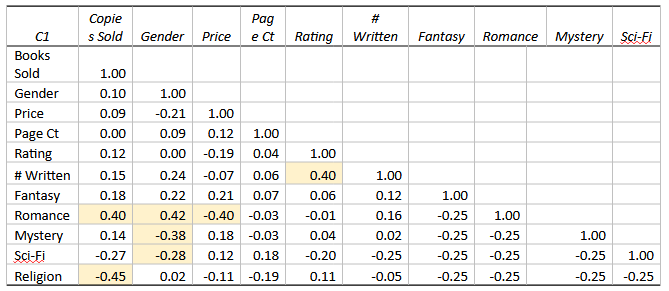

# Analysis: The Impact of Author Gender on Book Sales in Fiction

---

## Introduction
This analysis was performed to determine whether there is any gender bias in fiction book sales that would necessitate the use of pseudonyms. The analysis includes a regression model based on publicly available dataset of bestselling authors.

---

## The Questions

Are book sales impacted enough by an author's gender as to demand a pseudonym?
What actions might an author take to maximize sales based on their gender?

## The Data

Our population of interest is all fiction books sold.

Our sample data includes 50 book listings across five genres, pulled from the quarterly listings on Publisher’s Weekly from October 2020 to Jan 2021. (Publishers Weekly, 2021) This data includes book title, author name (from which we will determine gender assumption), publisher, page count, price, publishing date, and total units sold over the period.

### The Variables

**Dependent Variable**: 
- Total Books Sold

**Independent Variables**:

- Gender
- Price
- Page Count
- Review Rating
- Prior # of Books written by Author
- Genre (Fantasy, Romance, Mystery, Sci-fi, Religious)

---

## Analysis

### T-Test
*We used the separate-variance t-test to test our two sample means of books sold by women versus books sold by non-women, after having failed the F-test to use pooled variance. With an alpha level of .05, the p-value (.1727) for our one-tailed test fails to reject the null hypothesis, H0 = µ1 >= µ2, so we’re left with insufficient evidence to reject the hypothesis that women sell at least as many books as non-women so far.*

### Correlations

- The highest correlations to book sales seem to be the genre they’re written for:
  - Romance has relatively high positive correlation
  - Religious and sci-fi have stronger negative correlation
- Each genre also carries its own gender connotations:
  - Romance moderately correlates with sales
    - Also moderately correlates with women
    - Negatively correlates to book price.
  - Mystery and sci-fi inversely correlate, leaning toward non-female authors.
- The only other notable correlation is the review rating to the number of books written.

### Model

After some exploration with training data, Gender remained insignificant, reinforcing our inability to reach a conclusion on it. Instead, our interpretation of R-squared found that 49.41% of the variation in number of books sold by authors can be explained by variation in genre—specifically fantasy, romance, or mystery.

#### Our final regression equation is: 

√Y1(Books Sold) = b0 + b1(Gender) + b2(Genre(Fantasy)) + b3(Genre(Romance)) + b4(Genre(Mystery)) +e

Since the remaining variables are all binary, we can also reach 8 specific interaction breakdowns for each gender based on the three primary genres and the grouped remainder genres:

  - Female/Fantasy
  - Female/Romance
  - Female/Mystery
  - Female/Sci-fi/Religious
  - Male/Fantasy
  - Male/Romance
  - Male/Mystery
  - Male/Sci-fi/Religious

Taking the form of:
√Y1(Books Sold) = b0 + b1(Gender) * b2(Genre) + e

---
## Conclusion

Overall, the model fit is weak, and suffers from the exclusion of variables like marketing data, or book-cover judgment, which were not readily available factors as of this project.

There's no conclusion on gender effect on sales outside of genre, but we can make some interesting interpretations out of the interactions of the model that may help boost sales:

    1. For every 73 books sold, women who write romance will gain another 50 books sold on average
    2. For every 73 books sold, women will lose 19 book sales on average by writing sci-fi or religious fiction (and indeed, will always average 19 books less than men/non-female)
    3. For every 73 books sold, men will gain another 69 books sold if they write fantasy
    4. For every 73 books sold, men gain no additional sales by writing in sci-fi/religious

### Recommendations

