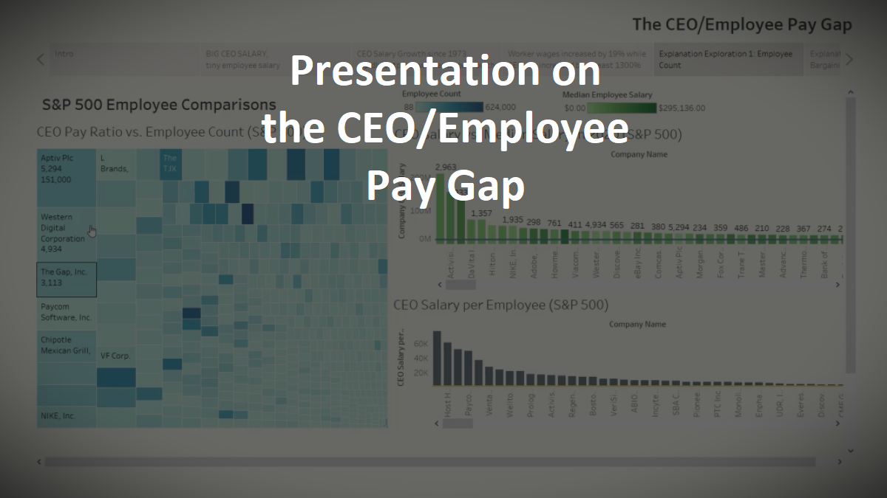

# Presentation: The CEO/Employee Wage Gap

---

## Introduction

This presentation follows a Tableau story delving into the pay differences between CEOs and their median workers, and the trends and factors that led to a ballooning gap across the board.

Tableau and analytical skills are displayed by the presentation linked below.

## The Questions

Since the 1970s, CEO salaries have balooned from 20x their median workers' salaries to well over 400x their median workers' salaries. Why has this happened? Is it justified?

---

## The Presentation

## The Data

The data is sourced primarily from The American Federation of Labor and Congress of Industrial Organizations and the Economic Policy Institute.

## Conclusion

For those interested but don't have the wherewithal to watch the presentation: 

While there are correlations between company size, market capitalization, and CEO pay, the conclusion on why CEO pay has ballooned isn't simply about the size of the company, the value of the CEO's work accomplishments, or even greed. 

It is instead an unintended result of legislation in the 1970s which required public companies to make their CEOs' pay public. Instead of being used as a watchdog initiative to prevent this very thing from happening, CEO pay instead become another bellwether for investors to determine a company's success-- a company that can pay its executives handsomely is a company that's doing well.

This means worker salary and CEO salary operate under opposite motivations-- worker salaries become an expense that shoould be kept as low as competitatively possible, while CEO salaries should be kept as high as competitively possible to signal the company's health.

Recommendations for correcting the imbalance would be to increase pay transparency across the board to potentially highlight any self-cannibalization a firm might suffer in order to compete in CEO salary; indeed, the surveys that formed the basis of this presentation were a result of a 2018 legislation requiring disclosure of the CEO-to-median-worker ratio of public firms.
