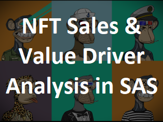
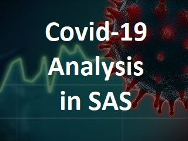
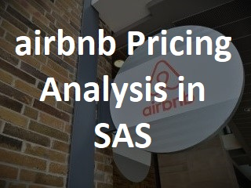
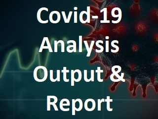
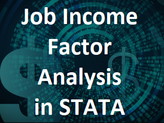

# Craig Powers
## Data Analysis Portfolio

---

Intro

---

## Projects

|    | CEO Pay Analysis |
| ------------- | ------------- |
| This analysis was performed to determine whether there is any gender bias in fiction book sales that would necessitate the use of pseudonyms. The analysis includes a regression model based on publicly available dataset of bestselling authors. | This presentation follows a Tableau story delving into the pay differences between CEOs and their median workers, and the trends and factors that led to a ballooning gap across the board.|

---

## Code Samples

A selection of sample code taken from various analysis projects.

     

    

 

---

linkedin and resume
